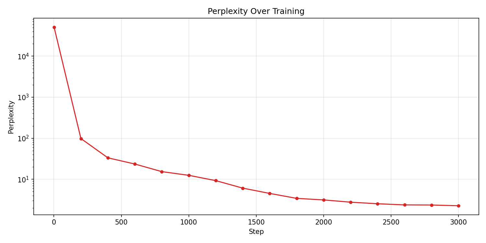
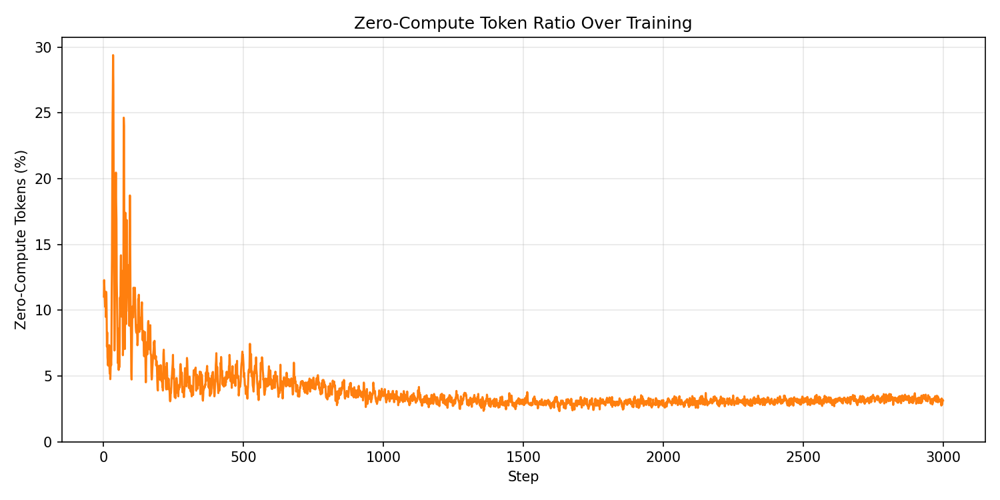

# MOE  with Null Experts (achieving weight sparsity + data sparsity)

This repo is a small implementation of the paper **[IMPROVING MOE COMPUTE EFFICIENCY BY COMPOSING WEIGHT AND DATA SPARSITY](https://arxiv.org/abs/2601.15370)** which mplements the core mechanism of **"Null Experts"** to achieve data sparsity in Mixture-of-Experts (MoE) transformers.(tested on shakespeare dataset)


## 🧠 Core Concept: Variable Compute
Standard MoE achieves **Weight Sparsity** by activating a fixed number ($k$) of experts per token.
**Data Sparsity** extends this by allowing the model to vary the number of active experts per token, reducing the **average** compute budget.

- **Mechanism:** The router includes virtual "Null" slots.
- **Behavior:** If a token routes to a Null Expert, the computation for **that specific slot** is skipped.
- **Result:** Instead of always running $k$ experts, the model might run $k-1$ or $k-2$ real experts for "easy" tokens.
    - *Example:* At $\rho=0.5$ (50% Data Sparsity) with Top-2 routing, the model activates **1 Real Expert on average** per token, rather than always activating 2.

---

## 🏗️ Technical Implementation


### 1. The "Null Copy" Expansion
The paper treats Data Sparsity as a hyperparameter $\rho$ (Target Compute Ratio). To achieve this target without changing the router logic, we artificially expand the output dimension.

*   **Real Experts:** $N$ (e.g., 8).
*   **Target Sparsity:** $\rho$ (e.g., 0.5 for 50% compute).
*   **Null Copies:** We calculate $M = N \cdot \frac{1 - \rho}{\rho}$.
*   **The Logic:** One learned Null Logit is duplicated $M$ times. The router applies Softmax over $N+M$ slots.

### 2. Auxiliary Load Balancing
To enforce the target sparsity, the model minimizes an **Auxiliary Load Balancing Loss**:

$$ L_{total} = L_{task} + \alpha \cdot L_{aux} $$


$$ L_{aux} = (N+M) \cdot \sum_{i=1}^{N+M} f_i \cdot P_i $$

This loss forces the router to distribute tokens uniformly across all $N+M$ slots. 

*   **Outcome:** Since Null Copies represent a fixed percentage of the total slots (e.g., 50%), the router is mathematically coerced into assigning 50% of the total slots to Null Experts.
*   **Effect:** This ensures that across the entire batch, the average number of active Real Experts matches the target $\rho$, even if individual tokens use different amounts of compute (0, 1, or 2 experts).

```
Let's trace a concrete example. Say batch_size=32, seq_len=128, so:

x_flat = (4096 tokens, 384)    # 32×128 = 4096 tokens

Step A — Router produces logits:
logits_raw = self.router(x_flat)  # (4096, 9)  →  8 real + 1 null

Step B — Duplicate null logit:
real_logits = logits_raw[:, :8]       # (4096, 8)
null_logit  = logits_raw[:, 8:]       # (4096, 1)
expanded_logits = cat([real, null×8]) # (4096, 16)  →  slots 0-7 real, 8-15 null

Step C — Top-K selection:
topk_vals, topk_idxs = topk(expanded_logits, k=4)  # (4096, 4)

For one token this might look like:
topk_idxs[0] = [3, 12, 5, 9]
                 ↑   ↑  ↑  ↑
               real null real null  ← anything ≥8 is null

Step D — Gate renormalization:
is_real = topk_idxs < 8   →  [True, False, True, False]
Softmax over top-K gives raw gates, e.g. [0.3, 0.25, 0.25, 0.2]. Then null gates zeroed and real gates renormalized:
raw:        [0.3,  0.25, 0.25, 0.2 ]
after zero: [0.3,  0,    0.25, 0   ]  ← nulls set to 0
renorm:     [0.545, 0,   0.455, 0  ]  ← divide by 0.55 so real gates sum to 1

Step E — Dispatch to experts:
for each of 4 top-K slots:
    for each of 8 experts:
        find tokens routed to this expert
        run expert FFN on those tokens only
        multiply by renormalized gate weight
        accumulate into combined_output
Null slots are simply skipped — no expert runs.

Step F — Add shared expert:
output = shared_expert(x_flat) + combined_output
The shared expert always runs on every token regardless of routing.

```

## Telemetry 

Each MoE layer stores telemetry in `self.last_*` attributes. The model aggregates across all 6 layers. Here are all 7 metrics with
concrete examples:


### 1. expert_counts — How many tokens each expert processed

**Inside the dispatch loop:**

```python
expert_counts[e] += mask.sum()  # count tokens routed to expert e
```

**Example output (averaged across 6 layers):**

```json
"expert_counts": [520, 485, 510, 530, 495, 512, 508, 500]
```

Means: Expert 0 processed 520 tokens, Expert 1 processed 485, etc. Perfect balance would be ~512 each (4096 tokens × 4 slots × 50% real
/ 8 experts).

--

### 2. null_ratio — Fraction of top-K selections that were null

```python
null_selections = (~is_real).sum()          # count of null picks
total_selections = num_tokens * top_k       # 4096 × 4 = 16384
null_ratio = null_selections / total_selections
```

Example: if 6500 of 16384 selections were null → null_ratio = 0.397 (39.7%). Target is 50%.

---

### 3. zero_compute_ratio — Tokens where ALL 4 selections were null

```python
zero_compute = (~is_real).all(dim=-1).sum()  # all 4 slots null?
zero_compute_ratio = zero_compute / num_tokens
```

Example: if 180 of 4096 tokens had all-null routing → 4.4%. These tokens only get the shared expert output; all 8 routed experts were
skipped entirely.

---

### 4. gate_weights — Average gate weight per expert

```python
gate_weight_sums[e] += gates[mask].sum()
gate_weight_counts[e] += mask.sum()
avg_gate = gate_weight_sums / gate_weight_counts
```

**Example:**

```json
"gate_weights": [0.48, 0.52, 0.45, 0.51, 0.49, 0.47, 0.53, 0.50]
```

Means: when tokens do route to Expert 0, the average renormalized gate is 0.48. Higher = the router is more confident about that expert.

---

### 5. lm_loss — Standard language modeling loss

```python
lm_loss = cross_entropy(logits, targets)
```

Example: 3.37 — this is what drives text quality.

---

### 6. balance_loss — Load balancing (Eq. 6)

```python
f = fraction_of_tokens_per_slot   # (16,) — how evenly tokens spread
P = avg_routing_probability       # (16,) — how evenly router assigns probs
balance_loss = 16 * dot(f, P)     # penalizes correlation between f and P
```

Example: 1.02. Perfect uniform balance gives 1.0 (16 × 16 × (1/16)²). Values above 1.0 mean some slots are overloaded.

---

### 7. z_loss — Router confidence penalty (Eq. 7)

```python
lse = logsumexp(expanded_logits, dim=-1)  # (4096,)
z_loss = mean(lse²)
```

Example: 3.36. Prevents the router from producing extremely large logits (which makes routing too sharp and unstable).


## 📊 Training Visualization


### 1. Sparsity Control
The architecture successfully enforces the target data sparsity ($\rho=0.5$). As shown below, the router learned to assign ~45-50% of slots to Null Experts, driven by the Auxiliary Loss.
.png>)

### 2. Load Balancing


| Utilization Heatmap | Cumulative Distribution |
|---------------------|-------------------------|
| 
.png>) | .png>)|


### 3. Training Stability
The model converged stably with no expert collapse.

.png>)


### 4. Perplexity 



### 5. zero compute  tokens 


Zero-compute tokens measures the percentage of tokens where all top-K selected experts were null experts — meaning the token received
  zero routed expert computation.


## Generation Samples
**Prompt:** `First Citizen: Before we proceed any further,`

**Sample 1 :**
> ...And hear our consul?
> **MENENIUS:** Take the scumbled: We'll rue him, he would lordts all the people.
> **SICINIUS:** Since our generalness would speak all the peo...

**Sample 2 :**
> ...And will charge you better.
> **DUKE VINCENTIO:** But now, poor brother, now will come to your lordship. All opposite all the rest of the north...

**Observation:**
The model retains correct Shakespearean syntax and dramatic structure despite skipping sparse computation for ~50% of the tokens. This confirms that the **Shared Expert** successfully handles the baseline linguistic modeling, allowing the model to offload tokens without catastrophic coherence loss.

## setup

### Installation
```bash
pip install torch transformers matplotlib numpy
```

### Run Training
```bash
python train.py --dataset tiny --steps 3000
```

### visualization 
and then visualize with 

```bash
python visualize.py
```

```
python run app.py
```


